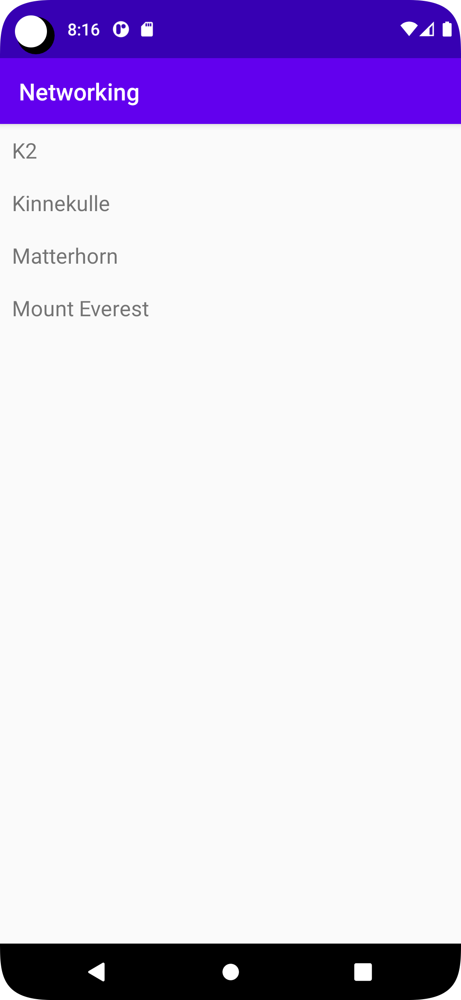

# Rapport

Det skapades en "MainActivity" klass som startar en AsyncTask för att ladda ner JSON-data från den angivna URL:en. 
När data har laddats ner, den är (parsed) med hjälp av Google Gson biblioteket och lagras i en lista av "Mountain" objekter.
Sedan konverteras listan till en lista av "RecyclerViewItem" objekter och visas i RecyclerView med hjälp av en adapter.

Det skapades också en "Mountain" klass för att representera data som hämtas från JSON API. Klassen har en "constructor" som initierar dessa fält, såväl som "getters" och "setters" för "ID" och "namn" fälten.

Dessutom har skapats en "RecyclerViewAdapter" klass som gör extends på "RecyclerView.Adapter" Klass för att visa "RecyclerViewItem" objekten i "RecyclerView". Klassen en kund "ViewHolder" klass som innehåller en "TextView" 
för att visa titeln på "RecyclerViewItem" objektet.

```
public class MainActivity extends AppCompatActivity implements JsonTask.JsonTaskListener {

    private final String JSON_URL = "https://mobprog.webug.se/json-api?login=brom";
    private final String JSON_FILE = "mountains.json";

    private ArrayList<Mountain> mountainList;

    RecyclerViewAdapter adapter;
    private RecyclerView view;

    ArrayList<RecyclerViewItem> items = new ArrayList<>();

    @Override
    protected void onCreate(Bundle savedInstanceState) {
        super.onCreate(savedInstanceState);
        setContentView(R.layout.activity_main);

        mountainList = new ArrayList<>();

        adapter = new RecyclerViewAdapter(this, items, new RecyclerViewAdapter.OnClickListener() {
            @Override
            public void onClick(RecyclerViewItem item) {
                Toast.makeText(MainActivity.this, item.getTitle(), Toast.LENGTH_SHORT).show();
            }
        });

        new JsonTask(this).execute(JSON_URL);

        RecyclerView view = findViewById(R.id.recycler_view);
        view.setLayoutManager(new LinearLayoutManager(this));
        view.setAdapter(adapter);

    }


    @Override
    public void onPostExecute(String json) {
        Log.d("MainActivity", json);
        Gson gson = new Gson();
        Type type = new TypeToken<List<Mountain>>() {}.getType();
        ArrayList<Mountain> list = gson.fromJson(json, type);
        mountainList.addAll(list);
        Log.d("Test", String.valueOf(mountainList.size()));
        for(Mountain mountain : mountainList){
            items.add(new RecyclerViewItem(mountain.getName()));
        }

        adapter.notifyDataSetChanged();

    }

}
```

```
public class RecyclerViewAdapter extends RecyclerView.Adapter<RecyclerViewAdapter.ViewHolder> {

    private List<RecyclerViewItem> items;
    private LayoutInflater layoutInflater;
    private OnClickListener onClickListener;

    RecyclerViewAdapter(Context context, List<RecyclerViewItem> items, OnClickListener onClickListener) {
        this.layoutInflater = LayoutInflater.from(context);
        this.items = items;
        this.onClickListener = onClickListener;
    }

    @Override
    @NonNull
    public ViewHolder onCreateViewHolder(@NonNull ViewGroup parent, int viewType) {
        return new ViewHolder(layoutInflater.inflate(R.layout.recyclerview_item, parent, false));
    }

    @Override
    public void onBindViewHolder(ViewHolder holder, int position) {
        holder.title.setText(items.get(position).getTitle());
    }

    @Override
    public int getItemCount() {
        return items.size();
    }

    public class ViewHolder extends RecyclerView.ViewHolder implements View.OnClickListener {
        TextView title;

        ViewHolder(View itemView) {
            super(itemView);
            itemView.setOnClickListener(this);
            title = itemView.findViewById(R.id.title);
        }

        @Override
        public void onClick(View view) {
            onClickListener.onClick(items.get(getAdapterPosition()));
        }
    }

    public interface OnClickListener {
        void onClick(RecyclerViewItem item);
    }
}
```

```
public class RecyclerViewItem {

    private String title;

    public RecyclerViewItem(String title) {
        this.title = title;
    }

    public String getTitle() {
        return title;
    }
}
```

```
public class Mountain {
    private String ID;
    private String name;

    public Mountain(String ID, String Name) {
        this.ID = ID;
        this.name = Name;
    }


    public String getID() {
        return ID;
    }

    public void setID(String ID) {
        this.ID = ID;
    }

    public String getName() {
        return name;
    }

    public void setName(String name) {
        this.name = name;
    }
}
```

```
<?xml version="1.0" encoding="utf-8"?>
<LinearLayout xmlns:android="http://schemas.android.com/apk/res/android"
    android:layout_width="match_parent"
    android:layout_height="wrap_content"
    android:orientation="horizontal"
    android:padding="10dp">

    <TextView
        android:id="@+id/title"
        android:layout_width="wrap_content"
        android:layout_height="wrap_content"
        android:textSize="18sp"/>

</LinearLayout>
```
```
<?xml version="1.0" encoding="utf-8"?>
<LinearLayout xmlns:android="http://schemas.android.com/apk/res/android"
    xmlns:app="http://schemas.android.com/apk/res-auto"
    xmlns:tools="http://schemas.android.com/tools"
    android:layout_width="match_parent"
    android:layout_height="match_parent"
    tools:context=".MainActivity">

    <androidx.recyclerview.widget.RecyclerView
        android:id="@+id/recycler_view"
        android:layout_width="match_parent"
        android:layout_height="match_parent"
        app:layout_constraintBottom_toBottomOf="parent"
        app:layout_constraintLeft_toLeftOf="parent"
        app:layout_constraintRight_toRightOf="parent"
        app:layout_constraintTop_toTopOf="parent" />

</LinearLayout>
```
```
<?xml version="1.0" encoding="utf-8"?>
<androidx.constraintlayout.widget.ConstraintLayout xmlns:android="http://schemas.android.com/apk/res/android"
    xmlns:app="http://schemas.android.com/apk/res-auto"
    xmlns:tools="http://schemas.android.com/tools"
    android:layout_width="match_parent"
    android:layout_height="match_parent"
    tools:context=".MainActivity">

    <androidx.recyclerview.widget.RecyclerView
        android:id="@+id/recycler_view"
        android:layout_width="match_parent"
        android:layout_height="match_parent"
        app:layout_constraintBottom_toBottomOf="parent"
        app:layout_constraintLeft_toLeftOf="parent"
        app:layout_constraintRight_toRightOf="parent"
        app:layout_constraintTop_toTopOf="parent" />

</androidx.constraintlayout.widget.ConstraintLayout>
```

Bilden.




